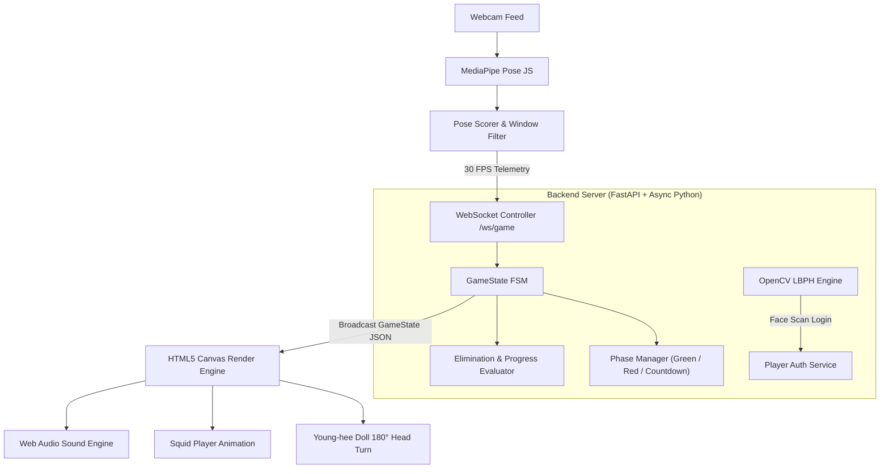

# 🦑 Squid Game: Red Light, Green Light
### 🎮 Computer Vision & Pose-Powered Web Application

An authentic, web-based computer-vision recreation of **Red Light, Green Light** from *Squid Game*. **Your body is the controller** — stand in front of your webcam, run in place to move your green tracksuit avatar, and freeze completely when the doll turns her head!

---

## 🌟 Key Features & Highlights

- 🎯 **Webcam Pose Controller**: Real-time **33-landmark body tracking** via MediaPipe. Jogging in place drives your character across the field.
- 🎭 **Authentic Squid Game Characters & Visuals**:
  - **Towering Young-hee Doll**: Stationary 3D body with **smooth 180° head-turning animation** during Red Light.
  - **Square & Circle Guards**: Positioned right next to the doll.
  - **Player 456**: Iconic green tracksuit avatar (#456) with dynamic running & falling animations.
- 🔊 **Authentic Audio & Dynamic Pace**:
  - Authentic Korean chant audio (`squid_chant.mp3`).
  - **Dynamic Tempo Engine**: Green Light chant speed changes randomly (1.0x normal, 1.5x-1.9x fast sprint, 0.8x slow-mo), keeping players on edge!
  - Abrupt music cutoffs, mechanical doll-turn sound, warning pulses, and gunshot SFX.
- ⚡ **Zero-Lag Stopping Algorithm**: Immediate sliding-window clear on physical stop + 0.65s reaction grace window to ensure 100% fair eliminations without false triggers.
- 🔒 **Facial Recognition Login**: OpenCV LBPH face authentication for instant passwordless login. **Strict privacy guaranteed** — all user face data is strictly ignored by Git (`.gitignore`).
- 🌐 **Real-Time Web Multiplayer**: Create or Join 4-letter room codes to play multi-device competitions over WebSockets!

---

## 🏗️ System Architecture

The application is built on a modern decoupled architecture: a **FastAPI Asynchronous WebSocket Backend** coupled with a high-performance **HTML5 Canvas & MediaPipe JS Frontend Engine**.



### 1. **Frontend Layer (Browser)**
- **HTML5 Canvas 2D Engine**: High FPS rendering pipeline drawing 3D-styled cutouts of the Young-hee Doll, Square/Circle Guards, Sandy Courtyard, and Player Avatars.
- **MediaPipe Pose (JavaScript)**: Extracts 33 body landmarks per frame directly inside the browser. Facial landmarks (0–10) are excluded to prevent head tilts from triggering false movement.
- **Web Audio API Engine**: Plays the authentic Squid Game chant audio with dynamic `playbackRate` tempo modulation, mechanical doll turn SFX, gunshot sounds, and victory fanfares.

### 2. **Backend Layer (Python / FastAPI)**
- **FastAPI Framework**: Serves RESTful routes (`/api/login/face`, `/api/register`, `/api/leaderboard`) and static assets.
- **WebSocket Game Engine (`/ws/game/{session_id}`)**: Handles real-time bi-directional telemetry:
  - Receives 30 FPS `movement` score streams from clients.
  - Controls match timers, distance calculations, countdowns, and dynamic Green Light tempos.
  - Broadcasts authoritative match state to clients.
- **OpenCV LBPH Face Recognizer**: Performs local face detection (Haar Cascade) and recognition (Local Binary Patterns Histograms) for facial registration and login.

---

## 🛠️ Technology Stack

| Domain | Technology | Description |
|---|---|---|
| **Core Architecture** | Python 3.10+, JavaScript (ES6+), HTML5, CSS3 | Asynchronous full-stack web app |
| **Backend Framework** | FastAPI, Uvicorn, Python WebSockets | High-concurrency async web & socket server |
| **Pose Estimation** | MediaPipe Pose JS (CDN) | Client-side 33-landmark 3D pose tracking |
| **Computer Vision** | OpenCV (`opencv-contrib-python-headless`) | LBPH face recognition & registration |
| **Audio Pipeline** | Web Audio API / HTML5 Audio | Multi-channel audio, dynamic playback rate control |
| **Rendering** | HTML5 2D Canvas Engine | 60 FPS sprite & character renderer |
| **Database** | SQLite3 | Thread-safe player profiles & match history |

---

## 🚀 Quick Start (Local Setup)

### 1. **Prerequisites**
- Python 3.10, 3.11, or 3.12 installed
- A working webcam

### 2. **Installation**
```bash
# Clone the repository
git clone https://github.com/Abhishek84094/Squid-Game--RedLight-GreenLight-Using-CV.git
cd Squid-Game--RedLight-GreenLight-Using-CV

# Create virtual environment
python -m venv venv
# Windows:
venv\Scripts\activate
# macOS/Linux:
source venv/bin/activate

# Install server dependencies
pip install -r requirements.txt
```

### 3. **Run the Web Application**
```bash
# Option A: Run directly with Python
python -m uvicorn server.main:app --host 0.0.0.0 --port 8000

# Option B: Run batch launcher (Windows PowerShell / CMD)
.\run_game.bat
```

Open your browser and navigate to:
👉 **`http://localhost:8000`**

---


---

## 📜 License & Credits

- Inspired by Netflix's *Squid Game*.
- Built with MediaPipe, OpenCV, FastAPI, and HTML5 Canvas.
